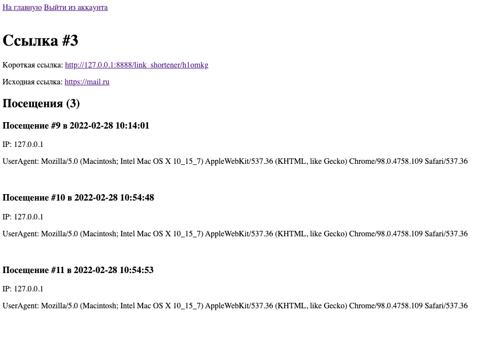

# link_shortener
Сокращатель ссылок.

## Установка
Так как присутствует `.htaccess` для роутинга, то запускать это дело надо на apache.

Данные от бд указываются в `config/config.json`

Далее необходимо запустить `reinstall.php`
(он так называется, потому что еще и дропает 
старые таблицы с названиями таблиц, используемых в проекте).

Все! Заходим на index.php, регистрируемся, создаем ссылки, 
переходим по ним и наслаждаемся.

Не трудно догадаться, что на дизайн упор не шел, но если это нужно, могу дополнить.

